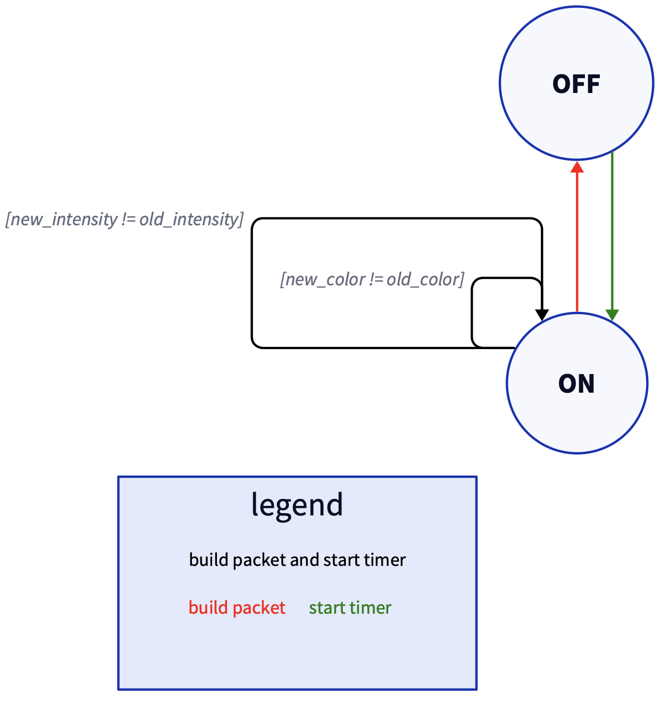
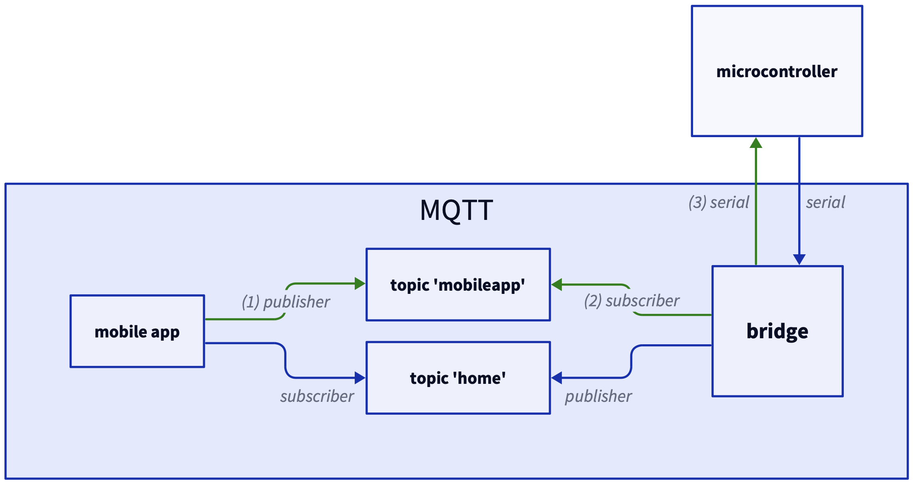
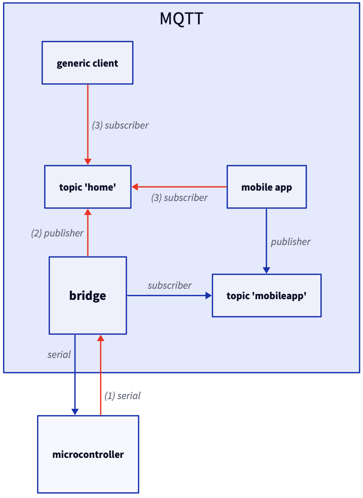
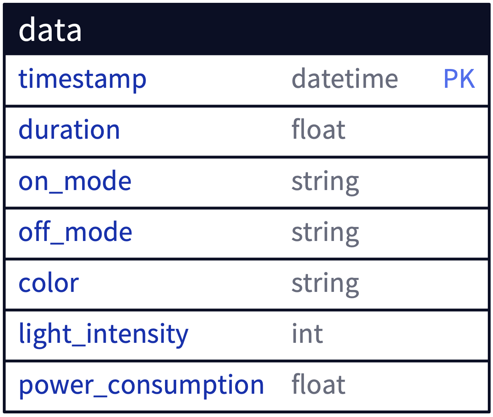

# STYLEGUIDE-bridge 

Code for the bridge of the [STYLEGUIDE](https://github.com/SaverioNapolitano/STYLEGUIDE.git) project

## Purpose 

The bridge acts as a go-between the [microcontroller](https://github.com/SaverioNapolitano/STYLEGUIDE-micro.git), the [mobile app](https://github.com/SaverioNapolitano/STYLEGUIDE-app.git) and the [server](https://github.com/SaverioNapolitano/STYLEGUIDE-server.git). It serves both as MQTT client (receiving messages from the mobile app and sending message to the mobile app and the server) and HTTP client (building packets and sending them to the server).

The bridge also allows the user to control their lights using their voice.

## How it works 

The bridge and the microcontroller talk to each other over a serial connection, while the communication with mobile app and server exploits both MQTT and HTTP protocols. 

### Serial Protocol

The bridge waits for messages from the micro on the serial (more details [here](https://github.com/SaverioNapolitano/STYLEGUIDE-micro?tab=readme-ov-file#serial-protocol)) and then processes them. 

#### Process Message (TO UPDATE)

When the bridge receives a message from the micro, four things can happen:
1. the bridge has to build (and send) a packet, start the timer and (optionally) notify the subscribers
2. the bridge has to build (and send) a packet and (optionally) notify the subscribers 
3. the bridge has to start the timer and (optionally) notify the subscribers 
4. the bridge has to notify the subscribers (happens when there is an update of the number of people in the room)

The first three cases are described by the following finite state machine (FSM) based on the type of the messages. Both the current received message and the previous received message are evaluated to decide what to do: 

### MQTT 

The bridge exchanges (sends and receives) MQTT messages with the mobile application and sends MQTT messages to the server. 

#### Mobile App -> Bridge 

The mobile app (e.g., the user) sends the bridge messages about the light status, its color and intensity, the bridge forwards the message to the micro while storing useful information for building the packet (see below). 

The information flow is the following: 

#### Bridge -> (Mobile App, Generic Client) 

The bridge receives from the micro messages about the light status, its color, intensity and cause, and the number of people in the room, and forwards them to both mobile app and any connected client. 

The information flow is the following: 

### HTTP 

The bridge builds and sends data packets to the server to store info about user habits and consumption, the server uses these info to compute relevant data for the user (see [here](https://github.com/SaverioNapolitano/STYLEGUIDE-server?tab=readme-ov-file#styleguide-server))

Data packets are basically rows of the database and their format is the following: 

### Voice Assistant

To control the light status and color using only your voice, the bridge features the voice assistant **Chuck** ([why Chuck? (Italian)](https://www.barzellette.net/frasi-chuck-norris.html)). 

Just call it (`Hey Chuck` or simply `Chuck`) and ask it to turn on/off your lights or to change the color of a light. 

Currently Chuck understands the following commands:
- turn on a light 
- turn off a light 
- change the light color to `COLOR`

and supports the following colors:
- white 
- red 
- green 
- blue 
- pink 
- purple
- yellow
- orange 

> [!NOTE]
> Chuck speaks only English.

